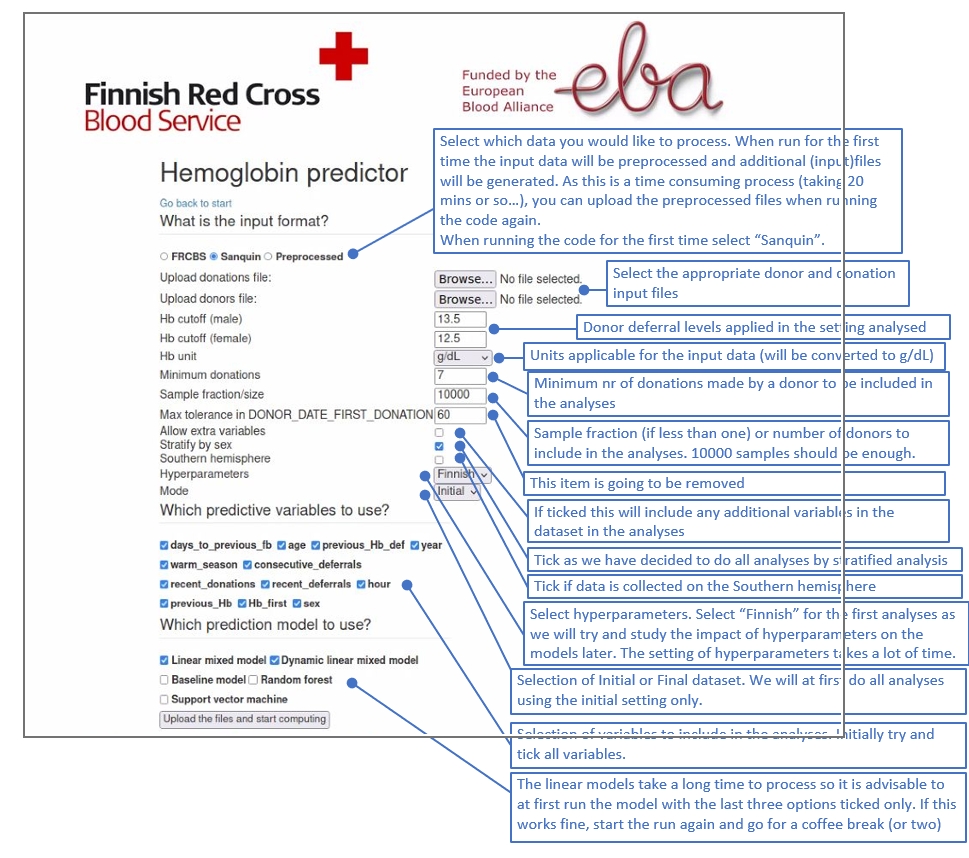

# Usage

## Quick start

Download
the docker image with command `docker pull toivoja/hb-predictor`.
A specific version (for example 0.23) can be downloaded with `docker pull toivoja/hb-predictor:0.23`.

```docker container run -it --rm -p 8080:8080 toivoja/hb-predictor```  

Then go to the following address in the browser:

http://localhost:8080/hb-predictor

Stop the computation (and the running container) by pressing control-c.

If you want to run a specific version of the container, use the form
```docker container run -it --rm -p 8080:8080 toivoja/hb-predictor:0.23```  
The version of the container is shown in red in the top right corner of the web page.

The input data to the container is two dataframes: one for donors and the other for donations.
These dataframes are given as text files, where each column is separated by the pipe character '|'.
If requested, I may add a possibility to specify the used separator in the user interface.
The first line of each file should contain the variable names. The variables are described
in this Excel file https://github.com/FRCBS/Hb_predictor_container/blob/master/minimal_input.xlsx . 
Note that this format may still change a bit or get clarified.

The container will first preprocess the input data before passing it to the prediction algorithms. The above
Excel file also gives the description of the preprocessed variables that will be used in prediction.

Two generated example files exist that should get you started. The example file that contains donations is here
https://raw.githubusercontent.com/FRCBS/Hb_predictor_container/master/generated_example_donations_sanquin.data
And the donor example file is here https://raw.githubusercontent.com/FRCBS/Hb_predictor_container/master/generated_example_donors_sanquin.data
The example data contains 5600 donations from 200 donors. The Hb unit in the example data is "g/dL", but the
preprocessed data and the output of the container always uses the unit "g/L".
Running the example data set using all predictions methods
took 6 minutes on my machine. The results the from the predictor are non-sensical.
This is provided to demonstrate the format of the data, and to let you test the container and see the results.
If time permits, I may add later a more realistic generated data set.

## Running on real data

It is recommended to start using the container with real data in four phases. The options that hold for all phases are:

* Stratify by sex: on
* Hyperparameters: Finnish (currently)
* Mode: Initial (currently)
* Select all variables as predictors
* Extra variables: off (We don't use extra variables, such as ferritin, at this point)

**NOTE** The effect of the sample size/fraction depends on the input format (raw or preprocessed). If input is in raw form, then the sample is taken *before* preprocessing. If the input is already preprocessed, then the sample is taken after donors with less than the specified number of donations (e.g. 7) are filtered out. 

### Phase 1. Testing that the input is in correct format

Because the input data is first preprocessed, and preprocesing might take a long time, it is useful to first try preprocessing only a small amount of data so that the possible errors appear quickly. For this try the following parameters:

* input format: Sanquin
* sample size: 1000 donors
* Minimum donations: not important at this phase
* Deselect all models. This ensures that preprocessing is done only, no models are fitted.

If this works, then the columns in the input data are probably correctly defined.

### Phase 2. Run preprocessing on full data

* Input format: Sanquin
* Sample size: 1.0 (meaning all data)
* Minimum donations: not important at this phase
* Deselect all models. This ensures that preprocessing is done only, no models are fitted.

This will take a few hours, depending on how much data and how fast computer you have.
If it works, download the preprocessed data (`preprocessed.rds`) for later use.

### Phase 3. Running some models with small amount of data

* Input format: preprocessed
* Input data: the `preprocessed.rds` file you got from phase 2.
* Sample size: 1000
* Minimum donations: 5
* Select the models you want to try. Random forest is a good start option.

### Phase 4. Running models with larger amount of data.

* Input format: preprocessed
* Input data: the `preprocessed.rds` file you got from phase 2.
* Sample size: 10000
* Minimum donations: 5

Try with at least baseline, random forest, and support vector machine algorithms. If it works, download the `results-0.28.zip` file (version number of the container is part of filename), which contains all results. 

## Contents of the resulting zip file

The `prediction.csv` file contains original Hb values (in g/L units) and sex of individuals, but no id and the row order is permuted. The `shap-value.csv` file contains the standardized explanatory variables with no id for a random sample of 1000 individuals. Different variables and individuals are on separate rows, and the order of the rows in the file is random. If the number of individuals in the test set is larger than the sample size 1000, then it should be impossible to recover the original, unstandardized variable values, even if one knew the mean and standard deviation of the variables in the original test set.

Verify that no (scrambled) individual level data is included before distributing a file.

## Mart's help picture

Mart's picture is otherwise accurate except the preprocessing will probably take more time than 20 minutes, and the internal Hb units are g/L, not g/dL. And the minimum number of donations should be 5 instead of 7, and the sample size in the end should be 10 000.




